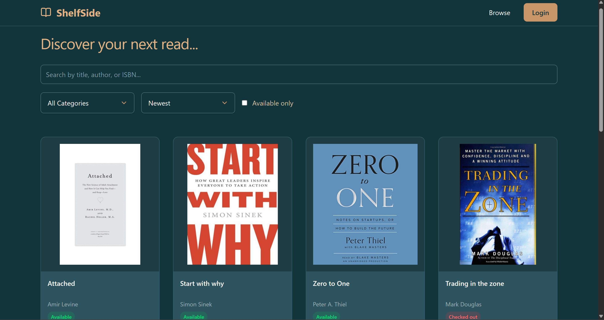
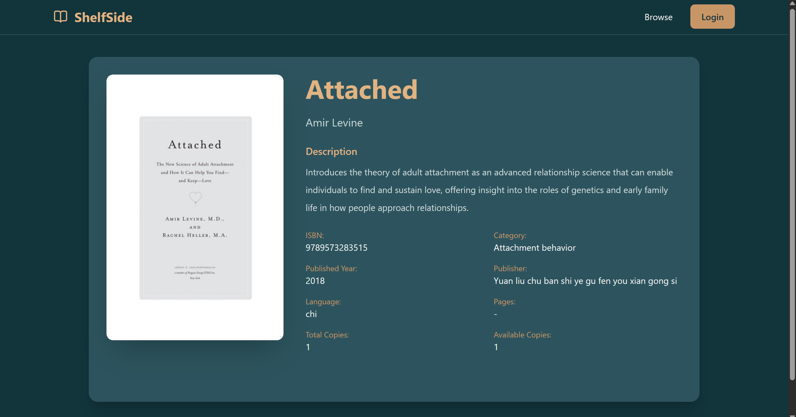
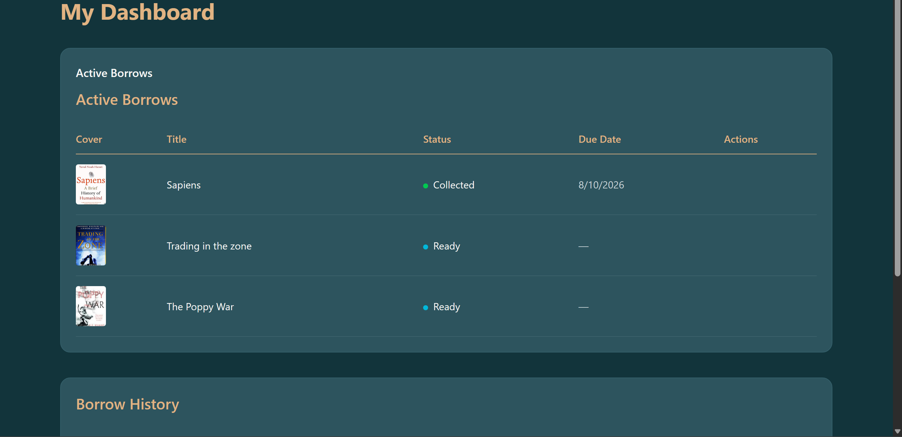
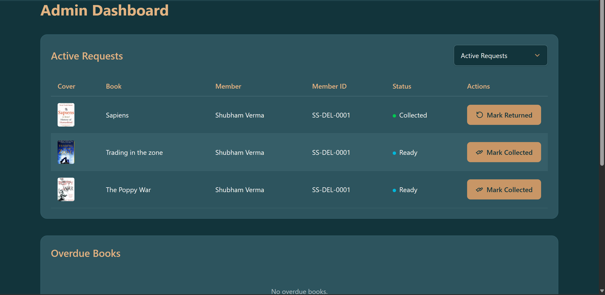
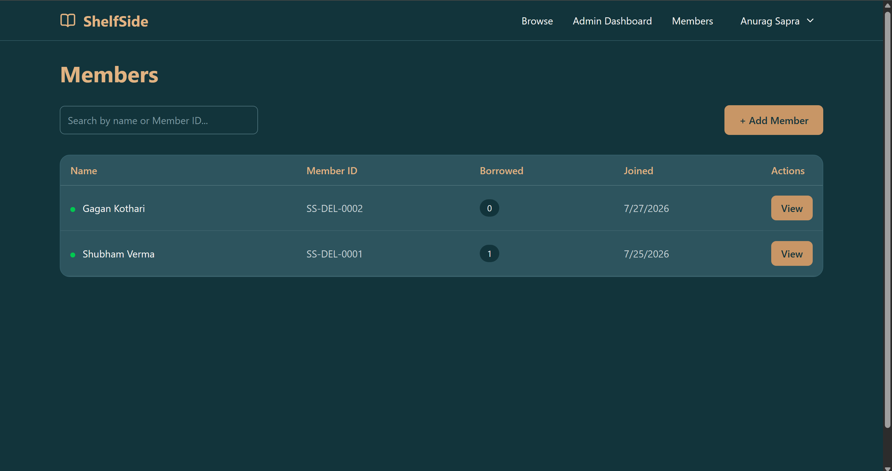

# 📚 ShelfSide

ShelfSide is a full-stack Library Management System built with the MERN stack that streamlines library operations for both members and administrators. It provides a complete borrowing workflow, role-based authentication, member management, overdue tracking, and an intuitive modern interface.

---

## ✨ Features

### 👤 Member Features

- Browse the complete library collection
- Search books by title, author, or ISBN
- Filter by category
- Sort books by newest, oldest, title, or popularity
- View detailed information about every book
- Request books for borrowing
- Cancel pending borrow requests
- View active borrow requests
- View complete borrowing history
- Mandatory password reset on first login

### 🛠️ Admin Features

- Add, edit, and delete books
- Add new library members
- View member profiles
- Activate/Deactivate members
- View member borrowing history
- Manage the complete borrowing workflow:
  - Approve requests
  - Reject requests with reason
  - Mark books as Ready for Pickup
  - Mark books as Collected
  - Mark books as Returned
- Track overdue books
- Automatic overdue fine calculation
- View all completed and cancelled requests

---

## 🔄 Borrow Workflow

```
Pending
   │
   ├── Approve
   │      │
   │      ▼
   │   Approved
   │      │
   │      ▼
   │   Ready
   │      │
   │      ▼
   │   Collected
   │      │
   │      ▼
   │   Returned
   │
   └── Reject
          ▼
      Rejected

Members can also cancel pending requests.
```

---

## 🛠 Tech Stack

### Frontend

- React
- React Router
- Tailwind CSS
- Axios
- Lucide React

### Backend

- Node.js
- Express.js
- MongoDB
- Mongoose
- JWT Authentication
- bcrypt
- Cookie Parser
- CORS

### Deployment

- Vercel (Frontend)
- Railway (Backend)

---

## 🔐 Authentication

- JWT Authentication
- HTTP-only Cookies
- Protected Routes
- Role-based Authorization
- First Login Password Reset
- Persistent Login Sessions

---

## 📸 Screenshots

### Home



### Book Details



### Member Dashboard



### Admin Dashboard



### Member Management



---

## 🚀 Local Setup

### Clone Repository

```bash
git clone https://github.com/<your-username>/ShelfSide.git
cd ShelfSide
```

### Backend

```bash
cd backend
npm install
```

Create a `.env`

```env
PORT=
MONGO_URI=
JWT_SECRET=
CLIENT_URL=
```

Run backend

```bash
npm run dev
```

### Frontend

```bash
cd frontend
npm install
npm run dev
```

---

## 📂 Project Structure

```
ShelfSide
│
├── frontend
│   ├── src
│   ├── public
│   └── ...
│
└── backend
    ├── controllers
    ├── middleware
    ├── models
    ├── routes
    └── ...
```

---

## 🌟 Highlights

- Complete end-to-end library borrowing workflow
- Clean reusable component architecture
- Responsive UI
- Modern dark-themed interface
- Role-based access control
- Automatic overdue fine calculation
- Pagination, filtering, and searching
- Secure authentication with HTTP-only cookies

---

## 🔮 Future Improvements

- Email notifications
- Barcode/QR code support
- Dashboard analytics
- Book cover uploads
- Reservation waitlist
- Fine payment integration
- Notifications for due dates

---

## 👨‍💻 Author

**Anurag Sapra**

GitHub: https://github.com/AnuragSapra

---

If you found this project interesting, consider giving it a ⭐.
